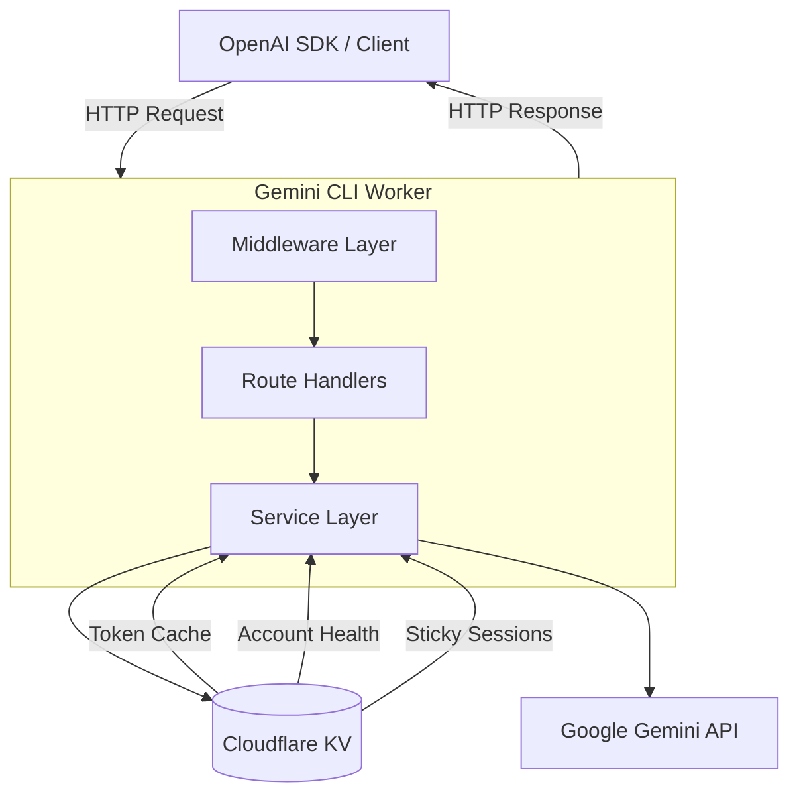
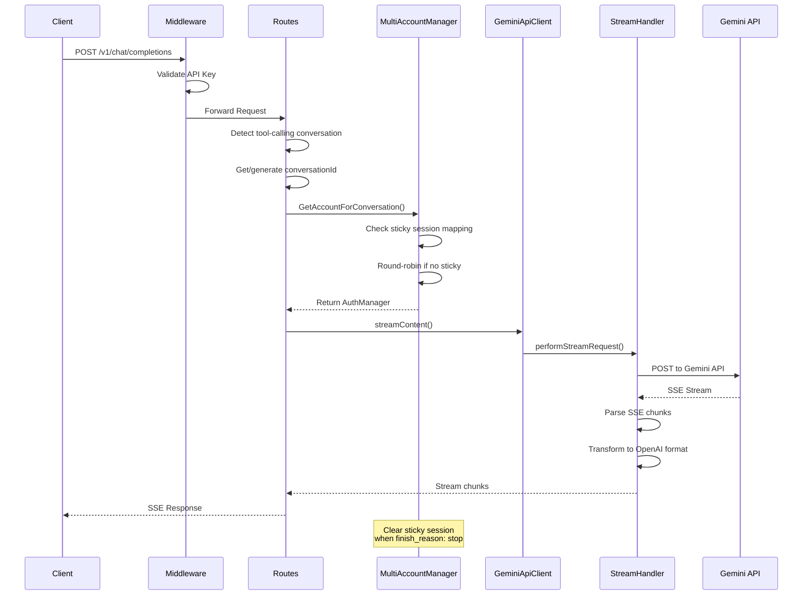
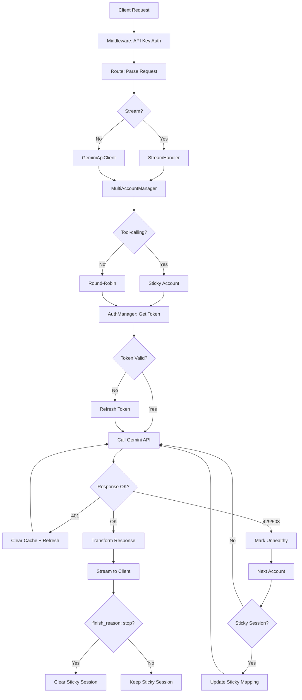
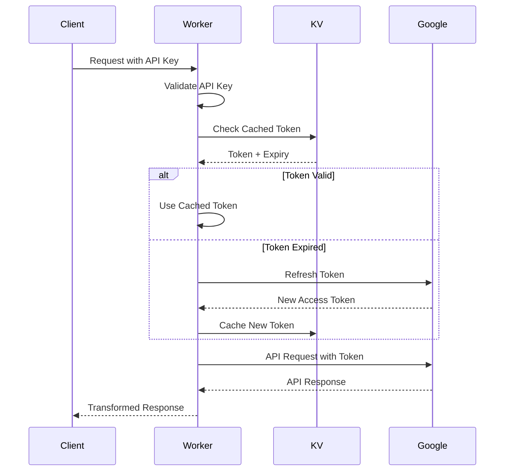

# Architecture Overview

**Project:** Gemini CLI OpenAI Proxy
**Type:** Cloudflare Worker - OpenAI-Compatible API Gateway
**Purpose:** Provides OpenAI-compatible API endpoints for Google's Gemini models via OAuth authentication
**Last Updated:** 2026-03-20

---

## Table of Contents

- [System Design](#system-design)
- [Directory Structure](#directory-structure)
- [Core Components](#core-components)
- [Key Architectural Patterns](#key-architectural-patterns)
- [Data Flow](#data-flow)
- [Security Model](#security-model)
- [Scalability Considerations](#scalability-considerations)
- [Environment Variables](#environment-variables)

---

## System Design

### High-Level Architecture



### Request Flow



---

## Directory Structure

```
src/
├── index.ts                      # Entry point - Hono app setup
│
├── config/                       # Configuration & constants
│   ├── index.ts                  # Barrel export
│   ├── endpoints.ts              # API endpoint URLs
│   ├── constants.ts              # OAuth & API constants
│   └── models.ts                 # Model definitions (gemini-2.5-pro, etc.)
│
├── types/                        # TypeScript type definitions
│   ├── index.ts                  # Barrel export
│   ├── env.ts                    # Environment bindings (Env interface)
│   ├── chat.ts                   # Chat message types
│   ├── gemini.ts                 # Gemini API types
│   ├── openai.ts                 # OpenAI-compatible types
│   ├── stream.ts                 # Streaming types
│   └── native-tools.ts           # Native tools types
│
├── services/                     # Core business logic
│   ├── index.ts                  # Barrel export
│   ├── gemini-client.ts          # Main orchestrator (~260 lines)
│   │
│   ├── auth/                     # Authentication service
│   │   ├── index.ts
│   │   └── auth-manager.ts       # OAuth2 token management
│   │
│   ├── account/                  # Multi-account management
│   │   ├── index.ts
│   │   ├── account-manager.ts    # Account rotation & sticky sessions
│   │   └── health.ts             # Account health tracking
│   │
│   ├── stream/                   # Streaming service
│   │   ├── index.ts
│   │   ├── handler.ts            # Stream request handling & retry logic
│   │   └── sse-parser.ts         # Server-sent events parsing
│   │
│   ├── message/                  # Message service
│   │   ├── index.ts
│   │   └── formatter.ts          # OpenAI ↔ Gemini conversion
│   │
│   ├── reasoning/                # Reasoning service
│   │   ├── index.ts
│   │   └── generator.ts          # Thinking mode generation
│   │
│   └── tools/                    # Tools service
│       ├── index.ts
│       ├── native-tools-manager.ts  # Native tools orchestration
│       ├── citations-processor.ts   # Citation formatting
│       └── response-processor.ts    # Native tool response handling
│
├── transformers/                 # Response transformation
│   ├── index.ts
│   └── openai-stream-transformer.ts  # Gemini → OpenAI stream format
│
├── routes/                       # HTTP route handlers
│   ├── index.ts
│   ├── openai.ts                 # /v1/chat/completions, /v1/models
│   └── debug.ts                  # Debug endpoints
│
├── middlewares/                  # HTTP middleware
│   ├── index.ts
│   ├── auth.ts                   # API key validation
│   └── logging.ts                # Request logging
│
├── helpers/                      # Helper utilities
│   ├── index.ts
│   ├── generation-config-validator.ts  # Request validation
│   └── auto-model-switching.ts   # Rate limit fallback
│
├── utils/                        # General utilities
│   ├── errors.ts                 # Error handling utilities
│   ├── validation.ts             # Input validation
│   ├── image-processing.ts       # Image handling
│   └── pdf-validation.ts         # PDF validation
```

### Import Patterns

The codebase uses **barrel exports** (index.ts re-exports) for clean imports:

```typescript
// ✅ Good - uses barrel exports
import { AuthManager, MultiAccountManager } from "../services";
import { ChatMessage, Tool } from "../types";

// ❌ Avoid - direct file imports (unless circular dependency)
import { AuthManager } from "../services/auth/auth-manager";
```

---

## Core Components

### 1. GeminiApiClient (`services/gemini-client.ts`)

**Role:** Main orchestrator that coordinates all services

**Responsibilities:**
- Project ID discovery and caching
- Service initialization and dependency injection
- High-level stream/non-stream API

**Key Methods:**
| Method | Purpose |
|--------|---------|
| `discoverProjectId()` | Discovers/caches GCP project ID per account |
| `streamContent()` | Streaming completion with sticky account support |
| `getCompletion()` | Non-streaming completion |

**Dependencies:**
- `MultiAccountManager` - Account selection
- `MessageFormatter` - Message conversion
- `StreamHandler` - HTTP streaming
- `SSEParser` - SSE parsing
- `ReasoningGenerator` - Thinking mode
- `AutoModelSwitchingHelper` - Rate limit fallback

---

### 2. MultiAccountManager (`services/account/account-manager.ts`)

**Role:** Manages multiple GCP service accounts with sticky session support

**Responsibilities:**
- Account initialization from environment variables
- Round-robin account rotation
- Sticky session mapping for tool-calling conversations
- Account health tracking integration

**Key Methods:**
| Method | Purpose |
|--------|---------|
| `getAccount()` | Get next healthy account via round-robin |
| `getAccountForConversation(convId)` | Get sticky account for tool-calling |
| `setStickyAccount(convId, accountId)` | Store sticky mapping in KV |
| `clearStickyAccount(convId)` | Clear sticky mapping when done |
| `updateStickyAccount(convId, newId)` | Update sticky on rate limit rotation |

**Sticky Account Flow:**
```
1. Detect tool-calling conversation (messages with role: "tool" or tool_calls)
2. Get/generate conversationId (X-Conversation-ID header or hash)
3. Check KV for existing sticky mapping
4. If found: use same account (or rotate if unhealthy)
5. If not found: get fresh account and store mapping
6. Clear mapping when finish_reason: "stop"
```

---

### 3. AuthManager (`services/auth/auth-manager.ts`)

**Role:** OAuth2 authentication and token management

**Responsibilities:**
- Token refresh via Google OAuth2
- KV-based token caching
- API endpoint calls

**Key Methods:**
| Method | Purpose |
|--------|---------|
| `initializeAuth()` | Initialize with cached or refreshed token |
| `refreshToken()` | Refresh expired access token |
| `callEndpoint()` | Generic API endpoint caller |
| `clearTokenCache()` | Clear cached token from KV |

**Token Lifecycle:**
```
1. Check KV for cached token
2. If valid (expires in > 5 min): use cached
3. If expired: refresh via OAuth2
4. Cache new token with TTL
```

---

### 4. StreamHandler (`services/stream/handler.ts`)

**Role:** HTTP streaming with retry logic and account rotation

**Responsibilities:**
- Perform stream requests to Gemini API
- Handle 401 errors (token refresh)
- Handle 429/503 errors (account rotation)
- Auto model switching fallback
- SSE parsing integration

**Retry Sequence:**
```
1. 401 Error → Clear token cache → Refresh → Retry (same account)
2. 429/503 Error → Mark account unhealthy → Get next account → Update sticky → Retry
3. All accounts exhausted → Auto model switching (if enabled)
```

---

### 5. SSEParser (`services/stream/sse-parser.ts`)

**Role:** Parse Server-Sent Events from Gemini API

**Responsibilities:**
- Parse SSE stream format
- Process candidate parts
- Handle thinking mode chunks
- Extract usage metadata

---

### 6. MessageFormatter (`services/message/formatter.ts`)

**Role:** Convert OpenAI message format to Gemini format

**Responsibilities:**
- Handle text, image, audio, video content
- Process tool messages
- Format system prompts

---

### 7. ReasoningGenerator (`services/reasoning/generator.ts`)

**Role:** Generate thinking mode output

**Responsibilities:**
- Fake thinking (simulated delay)
- Real thinking (model-based)
- Stream thinking as content

---

## Key Architectural Patterns

### 1. Sticky Account for Tool-Calling

**Problem:** Multi-turn tool calling breaks with per-request account rotation:
- Turn 1 → Account 1
- Turn 2 → Account 2 (different project config!)
- Turn 3 → Account 3 (scattered logs!)

**Solution:** Stick to ONE account for entire tool-calling conversation:

```typescript
// Detection
function isToolCallingConversation(messages: ChatMessage[]): boolean {
  return messages.some(msg =>
    msg.role === "tool" ||
    (msg.role === "assistant" && msg.tool_calls?.length > 0)
  );
}

// Conversation ID generation
function getConversationId(messages: ChatMessage[], headerId?: string): string {
  if (headerId) return headerId; // Client-provided
  // Hash first user message
  const content = messages.find(m => m.role === "user")?.content;
  return `conv_${djb2Hash(content)}`;
}

// KV Storage
Key: sticky:{conversation_id}
Value: account_index
TTL: 300 seconds (safety fallback)
```

**Edge Cases:**
| Scenario | Handling |
|----------|----------|
| Rate limit mid-conversation | Rotate account + update sticky mapping |
| Account unhealthy | Clear sticky + get fresh account |
| Conversation ends | Clear sticky mapping immediately |

---

### 2. Project ID Discovery

**Problem:** AI Pro tier accounts require explicit project ID; free tier auto-assigns.

**Discovery Flow:**
```
1. Check GEMINI_PROJECT_ID env var (bypass discovery)
2. Check cache (Map<number, string>)
3. Call loadCodeAssist API with "default-project" placeholder
4. Extract cloudaicompanionProject from response
5. Cache and return
```

**Response Analysis:**
```json
// Free Tier (works automatically)
{
  "cloudaicompanionProject": "red-analyzer-7qrth",
  "currentTier": { "id": "free-tier" }
}

// AI Pro Tier (requires manual project)
{
  "currentTier": {
    "id": "standard-tier",
    "userDefinedCloudaicompanionProject": true
  },
  "projectValidationError": {
    "message": "Permission denied on projects/default-project"
  }
  // No cloudaicompanionProject field!
}
```

**Solution:** Set `GEMINI_PROJECT_ID` for AI Pro accounts.

---

### 3. Multi-Account Rate Limit Mitigation

**Strategy:** Layered defense against rate limits

```
Layer 1: Account Rotation (primary)
  - Round-robin through GCP_SERVICE_ACCOUNT_0, _1, _2...
  - Skip unhealthy accounts (60s cooldown)
  - Persistent rotation index via KV

Layer 2: Sticky Sessions (tool-calling)
  - Keep same account for multi-turn conversations
  - Update sticky mapping on rate limit

Layer 3: Auto Model Switching (fallback)
  - Switch to smaller model on rate limit
  - Notification chunk about model switch
```

**Effective Throughput:**
```
Per Account: 60 requests/minute (free tier)
N Accounts:  N × 60 requests/minute (theoretical)
Sticky Tax:  Reduced efficiency during tool-calling
```

---

### 4. Service Orchestration Pattern

```
GeminiApiClient (Orchestrator)
├── MultiAccountManager (Account selection)
├── AuthManager (Token management)
├── StreamHandler (HTTP streaming)
│   └── SSEParser (SSE parsing)
├── MessageFormatter (Message conversion)
├── ReasoningGenerator (Thinking mode)
└── NativeToolsManager (Tool orchestration)
```

**Dependency Injection:**
```typescript
class GeminiApiClient {
  constructor(env: Env, multiAccountManager: MultiAccountManager) {
    this.messageFormatter = new MessageFormatter();
    this.sseParser = new SSEParser();
    this.streamHandler = new StreamHandler(
      env,
      multiAccountManager,
      this.messageFormatter,
      this.sseParser,
      this.discoverProjectId.bind(this) // Inject project ID getter
    );
    this.reasoningGenerator = new ReasoningGenerator();
  }
}
```

---

## Data Flow

### Request Lifecycle



### Response Transformation

```
Gemini API Response          OpenAI-Compatible Response
────────────────────────     ────────────────────────────
{                            {
  candidates: [{               choices: [{
    content: {                   delta: {
      parts: [{                    content: "Hello"
        text: "Hello"            }
      }]                       }
    }                          }],
  }],                        finish_reason: "stop"
  usageMetadata: {           },
    promptTokenCount: 10,    usage: {
    candidatesTokenCount: 20   prompt_tokens: 10,
  }                          completion_tokens: 20
}                          }
```

---

## Security Model

### Authentication Flow



### Token Management

| Token Type | Storage | Lifetime | Purpose |
|------------|---------|----------|---------|
| **API Key** | Client header | N/A | Client → Worker auth |
| **Access Token** | KV + Memory | ~1 hour | Worker → Gemini API |
| **Refresh Token** | Env variable | Years | Obtain new access tokens |

### Security Considerations

1. **API Key Validation:**
   - All `/v1/*` routes require valid `Authorization: Bearer <key>` header
   - Keys validated against `OPENAI_API_KEY` environment variable

2. **Token Storage:**
   - Refresh tokens stored in environment variables (encrypted at rest in Cloudflare)
   - Access tokens cached in KV with TTL (worker-scoped, not globally accessible)

3. **No Token Logging:**
   - Tokens never logged to console
   - Error messages redact sensitive data

4. **CORS Configuration:**
   - Currently allows all origins (`*`) for development flexibility
   - Consider restricting in production

---

## Scalability Considerations

### Cloudflare Workers Context

| Constraint | Limit | Mitigation |
|------------|-------|------------|
| CPU Time | 50ms (free), 10s (paid) | Async I/O, minimal computation |
| Memory | 128MB | Stream responses, don't buffer |
| KV Reads | 1000/day (free) | Cache tokens, batch operations |
| KV Writes | 1000/day (free) | Token caching only |

### KV Storage Strategy

**Keys Used:**
```
tokens:{account_index}         → Cached access token data
account_rotation_index         → Round-robin counter
health:{account_index}         → Account health status
sticky:{conversation_id}       → Sticky session mapping
```

**TTL Strategy:**
| Key | TTL | Rationale |
|-----|-----|-----------|
| Tokens | expiry - 5 min | Early refresh buffer |
| Health | 60 seconds | Rate limit cooldown |
| Sticky | 300 seconds | Safety fallback (immediate delete on finish) |

---

## Environment Variables

### Required

| Variable | Description |
|----------|-------------|
| `OPENAI_API_KEY` | API key for client authentication |
| `GCP_SERVICE_ACCOUNT_*` | OAuth2 credentials (JSON) for GCP accounts |

**Multi-Account Setup:**
```bash
# Numbered accounts (recommended)
GCP_SERVICE_ACCOUNT_0='{"client_id":"...","refresh_token":"..."}'
GCP_SERVICE_ACCOUNT_1='{"client_id":"...","refresh_token":"..."}'
GCP_SERVICE_ACCOUNT_2='{"client_id":"...","refresh_token":"..."}'

# Or legacy single account
GCP_SERVICE_ACCOUNT='{"client_id":"...","refresh_token":"..."}'
```

### Optional

| Variable | Default | Description |
|----------|---------|-------------|
| `GEMINI_PROJECT_ID` | (auto-discover) | Override project ID discovery |
| `GEMINI_CLI_KV` | (required) | KV namespace binding |
| `STICKY_SESSION_TTL_SECONDS` | 300 | Sticky session timeout |
| `ENABLE_REAL_THINKING` | false | Enable real thinking mode |
| `ENABLE_FAKE_THINKING` | false | Enable fake thinking (simulated delay) |
| `STREAM_THINKING_AS_CONTENT` | false | Stream thinking as text content |
| `ENABLE_GEMINI_NATIVE_TOOLS` | false | Enable native tools |

---

## Related Documents

- [Multi-Account Guide](./multi-account-guide.md) - Detailed multi-account configuration
- [Sticky Sessions](./sticky-sessions.md) - Tool-calling conversation design

---

*Document Version: 2.0*
*Last Updated: 2026-03-20*
