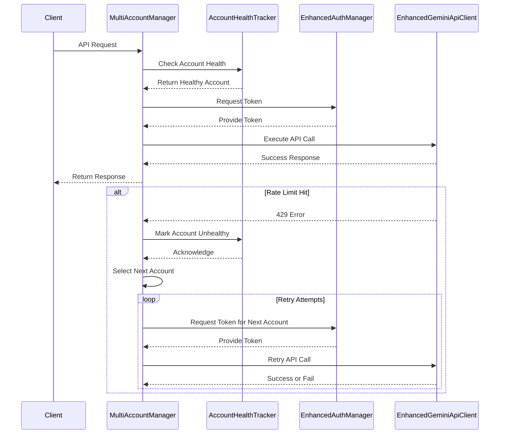

# Multi-Account Support for Gemini CLI

## Table of Contents

- [Overview](#overview)
- [Features](#features)
- [Benefits](#benefits)
- [Configuration](#configuration)
- [Usage](#usage)
- [Implementation Details](#implementation-details)
- [Troubleshooting](#troubleshooting)
- [Best Practices](#best-practices)

## Overview

Gemini CLI frequently encounters rate limits during heavy usage. Multi-account support addresses this by intelligently rotating between multiple Google Cloud service accounts, providing automatic failover and increased throughput.

## Features

- **Intelligent Rotation**: Accounts are rotated in a sequential round-robin fashion. The rotation index is persisted in global KV storage, ensuring strictly sequential account usage across all distributed Worker instances.
- **Account Health Tracking**: The system tracks which accounts are rate-limited and automatically skips them until the cooldown period expires (60 seconds default).
- **Seamless Failover**: When a request fails with HTTP 429 or 503, the system immediately switches to the next available account and retries the request (up to 3 attempts, scanning through the account list).
- **Stateless & Distributed**: Account rotation state is stored in Cloudflare KV, ensuring consistent behavior across all edge locations and worker instances.
- **Token Caching**: Each account's OAuth token is cached independently in KV storage for optimal performance.
- **Works with Auto Model Switching**: Multi-account rotation and auto model switching can be used together for maximum resilience.

## Benefits

- **Increased Throughput**: Effectively multiplies your rate limit capacity by the number of accounts.
- **Uninterrupted Service**: Automatic failover ensures requests don't fail due to rate limits.
- **Simple Setup**: Just authenticate multiple Google accounts and combine their credentials into an array.
- **Production-Ready**: Designed for serverless Cloudflare Workers with distributed state management.

## Configuration

### Environment Variables

Set the following environment variables for each account, `GCP_SERVICE_ACCOUNT_{sequence_number}` where `{sequence_number}` starts from 0:

```
GCP_SERVICE_ACCOUNT_0={"access_token":"ya29...","refresh_token":"1//...","scope":"...","token_type":"Bearer","id_token":"eyJ...","expiry_date":1750927763467}
GCP_SERVICE_ACCOUNT_1={"access_token":"ya29...","refresh_token":"1//...","scope":"...","token_type":"Bearer","id_token":"eyJ...","expiry_date":1750927763467}
```

Each variable should contain a JSON string with the OAuth credentials for that account.

### KV Namespaces

| Binding | Purpose |
|---------|---------|
| `GEMINI_CLI_KV` | Token caching, session management, account rotation state, and account health tracking |

## Usage

Once configured, the multi-account system operates transparently. API requests will automatically use available accounts, rotating as needed to avoid rate limits. No changes to your existing API calls are required.

## Implementation Details

### Key Components

- **MultiAccountManager**: Manages account selection and rotation logic.
- **AccountHealthTracker**: Monitors account status and rate limit cooldowns.
- **Enhanced AuthManager**: Handles authentication and token management for multiple accounts.
- **Enhanced GeminiApiClient**: Extended client with multi-account support and failover.

### Configuration Changes

- Environment variables: Add GCP_SERVICE_ACCOUNT_0, GCP_SERVICE_ACCOUNT_1, etc., as JSON strings.
- KV usage: Utilize GEMINI_CLI_KV for storing account health, tokens, and rotation state.

### Error Handling Strategies

- Automatic retry on 429/503 errors with account switching.
- Exponential backoff for retries.
- Logging of failures for monitoring.

### Integration with Existing Features

- Compatible with auto model switching.
- Stateless design for distributed environments.

### Scalability and Security Considerations

- Horizontal scaling via KV for state.
- Secure token storage in KV.
- Rate limit distribution across accounts.

### Multi-Account Request Flow



## Troubleshooting

- **All accounts rate-limited**: If all accounts are simultaneously rate-limited, requests will fail. Increase the number of accounts or wait for cooldown.
- **Authentication errors**: Verify that all service account credentials are valid and properly formatted.
- **KV storage issues**: Ensure the KV namespace is correctly bound and accessible.
- **Inconsistent behavior**: Check that all worker instances are using the same KV namespace for state consistency.

## Best Practices

- Use at least 3-5 accounts for optimal resilience.
- Monitor account usage and health through logs.
- Regularly rotate refresh tokens to maintain security.
- Test failover scenarios in a staging environment before production deployment.
- Combine with auto model switching for maximum API resilience.
