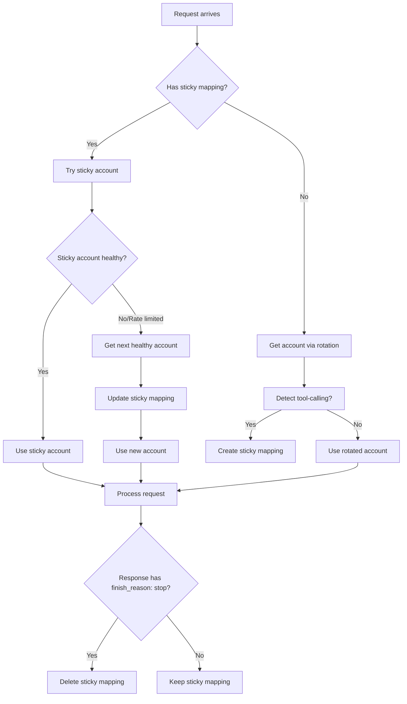

# Sticky Account Architecture for Tool-Calling Conversations

## Executive Summary

This document provides architectural recommendations for implementing "sticky account" routing to solve multi-turn tool calling issues in the Gemini API proxy.

---

## 1. Is This the Right Approach? ✅

**Verdict: Yes, with caveats**

The sticky account approach is architecturally sound:

### Why It Works
- **State Consistency**: Tool-calling conversations are inherently stateful; binding to one account ensures project context consistency
- **Predictable Rate Limits**: All turns hit the same account quota, making rate limit behavior predictable
- **Debugging**: Logs are centralized to one account
- **Backwards Compatible**: Normal requests continue using round-robin

### Architectural Concerns
| Concern | Impact | Mitigation |
|---------|--------|------------|
| KV latency | +10-50ms per operation | Batch operations, cache locally |
| Race conditions | Sticky mapping conflicts | Atomic KV operations with retries |
| KV bloat | Orphaned sticky mappings | Immediate delete when done, TTL fallback |
| Account failure mid-conversation | Stuck with bad account | Fallback to rotation + update sticky |

---

## 2. Conversation ID Generation

### Recommended: Hybrid Approach

```typescript
// Priority order:
// 1. Client-provided X-Conversation-ID header (explicit)
// 2. Hash of message content + model (deterministic)
// 3. Hash of last user message + timestamp (fallback)
```

### Option Comparison

| Approach | Pros | Cons | Recommendation |
|----------|------|------|----------------|
| **Client header** | Explicit control, works across restarts | Requires client support | ✅ Primary |
| **Message hash** | Deterministic, no client changes | Changes if content changes | ✅ Fallback |
| **UUID in first response** | Clean, trackable | Requires client to echo back | ⚠️ Complex |
| **OpenAI's conversation ID** | Compatible with OpenAI SDK | Need to extract/store | ⚠️ Implementation heavy |

### Implementation: Message Content Hash

```typescript
function generateConversationId(messages: ChatMessage[]): string {
  // Use a subset to avoid hashing huge histories
  const relevantMessages = messages.slice(-6); // Last 3 turns
  const content = relevantMessages
    .map(m => `${m.role}:${JSON.stringify(m.content)}`)
    .join('|');

  // Simple hash for demo - use xxhash or similar in production
  return `conv_${btoa(content).slice(0, 32)}`;
}
```

**Why last 3 turns?**
- Tool-calling conversations typically have short windows
- Reduces collision probability
- Limits hash computation time

---

## 3. Edge Cases: Rate Limit Mid-Conversation

### Current Plan (Rotate + Update Sticky)

**Good approach.** Here's the refined logic:

```
IF sticky account rate limited:
  1. Call getAccount() to get next healthy account
  2. Update sticky mapping: sticky:{conv_id} → new_account_index
  3. Log account switch for debugging
  4. Continue with new account
```

### Detailed Flow



### Race Condition Handling

```typescript
// When updating sticky mapping, use atomic compare-and-swap pattern
async function updateStickyAccount(
  convId: string,
  newAccountIndex: number
): Promise<void> {
  const key = `sticky:${convId}`;

  // Read current
  const current = await kv.get(key);

  // Only update if it still exists (wasn't cleared by another request)
  if (current !== null) {
    await kv.put(key, newAccountIndex.toString());
    console.log(`[Sticky] Rotated conversation ${convId} to account ${newAccountIndex}`);
  }
}
```

---

## 4. Storage: KV Design

### Recommended Key Structure

```
Key: sticky:{conversation_id}
Value: {account_index}|{created_at}|{last_used}
TTL: None (immediate delete when done)
```

### Why No TTL?

| Aspect | Recommendation | Rationale |
|--------|----------------|-----------|
| **Cleanup** | Immediate delete on `finish_reason: stop` | Clean, predictable |
| **TTL fallback** | Optional 5-minute TTL | Safety net for orphaned entries |
| **Format** | Pipe-delimited string | Simple, no JSON parse overhead |

### Storage Operations

```typescript
interface StickyMapping {
  accountIndex: number;
  createdAt: number;
  lastUsed: number;
}

// Parse: "2|1709123456789|1709123459999"
function parseStickyValue(value: string): StickyMapping {
  const [accountIndex, createdAt, lastUsed] = value.split('|').map(Number);
  return { accountIndex, createdAt, lastUsed };
}
```

### Cleanup Strategy

1. **Primary**: Delete immediately when `finish_reason: stop` detected
2. **Safety**: 5-minute TTL as backup
3. **Maintenance**: Optional weekly cleanup job for orphaned entries

---

## 5. Future Enhancement: "Busy" Account Tracking

### Defer This (as planned)

**Rationale**: Adds complexity without solving the immediate tool-calling problem.

### If Implemented Later

Track "busy" accounts separately from "unhealthy":

```typescript
interface AccountStatus {
  healthy: boolean;      // From health.ts
  busy: boolean;         // Has active sticky conversations
  activeConversations: string[]; // Conversation IDs
}
```

Rotation logic:
```
Select account where:
  - healthy === true
  - busy === false (preferred) OR has fewest active conversations
```

---

## 6. Alternative Approaches

### Option A: Consistent Hashing (Rejected)

```typescript
// Hash conversation ID to consistently pick same account
function getAccountForConversation(convId: string, accountCount: number): number {
  const hash = hashString(convId);
  return hash % accountCount;
}
```

**Why not**: Doesn't handle rate limits well - stuck with same account even if rate limited.

### Option B: Session Affinity via Cloudflare (Rejected)

Use Cloudflare's session affinity features.

**Why not**: Requires Cloudflare Load Balancer (paid), overkill for this use case.

### Option C: Per-Conversation Queue (Rejected)

Queue all requests for a conversation to ensure sequential processing.

**Why not**: Too complex, introduces latency and single-point-of-contention.

---

## Implementation Recommendations

### Files to Modify

| File | Changes |
|------|---------|
| `src/services/account/account-manager.ts` | Add `getAccountForConversation()` method |
| `src/routes/openai.ts` | Detect tool-calling, extract/generate conversation ID |
| `src/services/stream/stream-handler.ts` | Handle sticky cleanup on `finish_reason: stop` |
| `src/types/env.ts` | Add optional `STICKY_SESSION_TTL_SECONDS` env var |

### Code Structure

```typescript
// account-manager.ts
export class MultiAccountManager {
  // Existing methods...

  async getAccountForConversation(
    conversationId?: string,
    isToolCalling: boolean = false
  ): Promise<{ account: AuthManager; isSticky: boolean }> {
    if (!conversationId || !isToolCalling) {
      // Normal rotation
      return { account: await this.getAccount(), isSticky: false };
    }

    // Try to get sticky mapping
    const stickyKey = `sticky:${conversationId}`;
    const stickyValue = await this.env.GEMINI_CLI_KV.get(stickyKey);

    if (stickyValue) {
      const { accountIndex } = parseStickyValue(stickyValue);

      // Check if account is healthy
      if (await this.healthTracker.isAccountHealthy(accountIndex)) {
        return { account: this.accounts[accountIndex], isSticky: true };
      }

      // Account unhealthy - rotate and update sticky
      const newAccount = await this.getAccount();
      await this.updateStickyMapping(conversationId, newAccount.id);
      return { account: newAccount, isSticky: true };
    }

    // No sticky mapping - create one
    const account = await this.getAccount();
    await this.createStickyMapping(conversationId, account.id);
    return { account, isSticky: true };
  }

  async clearStickySession(conversationId: string): Promise<void> {
    await this.env.GEMINI_CLI_KV.delete(`sticky:${conversationId}`);
  }
}
```

### Detection Logic

```typescript
// openai.ts
function isToolCallingConversation(messages: ChatMessage[]): boolean {
  return messages.some(msg =>
    msg.role === 'tool' ||
    (msg.role === 'assistant' && msg.tool_calls && msg.tool_calls.length > 0)
  );
}

function getConversationId(
  c: Context,
  messages: ChatMessage[]
): string | undefined {
  // 1. Check header
  const headerId = c.req.header('X-Conversation-ID');
  if (headerId) return headerId;

  // 2. Check if tool-calling
  if (!isToolCallingConversation(messages)) {
    return undefined; // No sticky needed for normal conversations
  }

  // 3. Generate from messages
  return generateConversationId(messages);
}
```

---

## Summary

| Question | Recommendation |
|----------|----------------|
| **Right approach?** | ✅ Yes, sticky account is sound |
| **Conversation ID** | Client header → message hash fallback |
| **Rate limit mid-convo** | Rotate + update sticky mapping |
| **Storage** | KV with immediate delete, optional TTL fallback |
| **Busy tracking** | ⏸️ Defer |
| **Alternatives** | Consistent hashing rejected (doesn't handle rate limits) |

The proposed solution is architecturally sound. Focus on clean cleanup logic and race condition handling during implementation.
