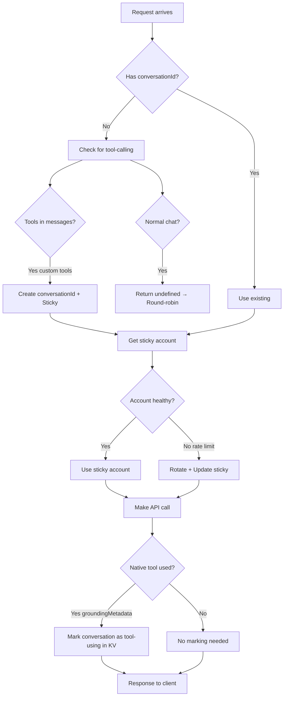

# Sticky Account Architecture for Tool-Calling Conversations

**Status:** ✅ **IMPLEMENTED** (2026-03-20)

This document describes the implemented sticky account routing system for multi-turn tool calling in the Gemini API proxy.

---

## Executive Summary

**Implemented Features:**
- ✅ Sticky sessions for **custom tools** (MCP) - detected from message history
- ✅ Sticky sessions for **native tools** (google_search, url_context) - detected from response metadata
- ✅ Round-robin for normal chat (no tools)
- ✅ Rate limit rotation with sticky mapping updates
- ✅ KV-based tool usage tracking

---

## 1. Architecture Overview ✅ IMPLEMENTED

### How It Works



### Key Design Decisions

| Decision | Implementation | Rationale |
|----------|---------------|-----------|
| **Sticky for custom tools** | Detect `tool_calls` in messages | MCP tools need consistent project context |
| **Sticky for native tools** | Detect `groundingMetadata` in response | Native tools share Gemini API quota |
| **Round-robin for chat** | Return `undefined` from `getConversationId()` | No state to maintain |
| **Rate limit rotation** | Update sticky mapping on 429/503 | Maintains consistency while handling limits |

---

## 2. Implementation Details ✅

### 2.1 Conversation ID Generation

**File:** `src/routes/openai.ts`

```typescript
function getConversationId(messages: ChatMessage[], headerId?: string): string | undefined {
    // Priority 1: Client-provided header
    if (headerId && headerId.trim().length > 0) {
        return headerId.trim();
    }

    // Priority 2: Check if tool-calling
    const hasToolCalls = messages.some(msg =>
        msg.role === "tool" ||
        (msg.role === "assistant" && (msg.tool_calls?.length ?? 0) > 0)
    );

    if (!hasToolCalls) {
        return undefined; // Normal chat → round-robin
    }

    // Priority 3: Generate from first user message
    // ... hash generation ...
}
```

**Behavior:**
| Scenario | Returns | Account Selection |
|----------|---------|-------------------|
| Client header provided | Header value | Sticky |
| Custom tools in messages | Generated hash | Sticky |
| Normal chat (no tools) | `undefined` | Round-robin |

---

### 2.2 Tool Detection

**Custom Tools (MCP)** - Detected from messages:

```typescript
// In account-manager.ts
const hasCustomTools = messages.some(msg =>
    msg.role === "tool" ||
    (msg.role === "assistant" && (msg.tool_calls?.length ?? 0) > 0)
);
```

**Native Tools (Gemini API)** - Detected from response:

```typescript
// In stream-handler.ts
const hasGroundingMetadata =
    (candidate?.groundingMetadata?.webSearchQueries?.length ?? 0) > 0 ||
    (candidate?.groundingMetadata?.groundingChunks?.length ?? 0) > 0;
const hasUrlContext = candidate?.content?.parts?.some(part => part.url_context_metadata) ?? false;

if ((hasGroundingMetadata || hasUrlContext) && conversationId) {
    await this.multiAccountManager.markConversationAsToolUsing(conversationId);
}
```

---

### 2.3 KV Storage

**Keys Used:**

| Key Pattern | Purpose | TTL |
|-------------|---------|-----|
| `sticky:{conversation_id}` | Sticky account mapping | 300s (safety) |
| `tool_usage:{conversation_id}` | Native tool usage flag | 3600s |
| `account_rotation_index` | Round-robin counter | None |

**Tool Usage Tracking:**

```typescript
// Mark conversation when native tools detected
public async markConversationAsToolUsing(conversationId: string): Promise<void> {
    const key = `tool_usage:${conversationId}`;
    await this.env.GEMINI_CLI_KV.put(key, "true", { expirationTtl: 3600 });
}

// Check if conversation used tools
public async hasUsedTools(conversationId: string): Promise<boolean> {
    const value = await this.env.GEMINI_CLI_KV.get(`tool_usage:${conversationId}`);
    return value === "true";
}
```

---

## 3. Account Selection Flow ✅

### getAccountForConversation() Logic

```typescript
public async getAccountForConversation(
    conversationId: string,
    messages: ChatMessage[]
): Promise<AuthManager> {
    // Check for custom tools (from messages)
    const hasCustomTools = messages.some(msg => /* ... */);

    // Check for native tools (from KV)
    const hasNativeTools = await this.hasUsedTools(conversationId);

    // No tools ever used → Round-robin
    if (!hasCustomTools && !hasNativeTools) {
        return this.getAccount();
    }

    // Tools used → Sticky session
    const stickyAccountId = await this.getStickyAccountId(conversationId);

    if (stickyAccountId !== null) {
        const account = this.accounts.find(acc => acc.id === stickyAccountId);
        if (account && await this.healthTracker.isAccountHealthy(stickyAccountId)) {
            return account; // Use sticky
        }
        // Unhealthy → Rotate below
    }

    // No sticky or unhealthy → Get fresh + create mapping
    const account = await this.getAccount();
    await this.setStickyAccount(conversationId, account.id);
    return account;
}
```

---

## 4. Rate Limit Handling ✅

### Flow on 429/503 Error

```
1. Detect rate limit (429/503)
   ↓
2. Mark account as unhealthy (60s cooldown)
   ↓
3. Call getAccount() → Get next healthy account
   ↓
4. Update sticky mapping: sticky:{conv_id} → new_account
   ↓
5. Retry request with new account
```

### Log Output

```
[Mitigation] Sequence step: Rate limit (429) - Account rotation initiated
             from GCP_SERVICE_ACCOUNT_4: fortewallet
[Mitigation] Account rotation: Attempt 1/18 - Selected GCP_SERVICE_ACCOUNT_5: ctaste61
[Mitigation] Sticky account updated: conv_449... → Account 5
```

---

## 5. Expected Behavior ✅

### Scenario Matrix

| Turn | Scenario | Detection | Account | Sticky? |
|------|----------|-----------|---------|---------|
| 1 | Custom tools (MCP) | `tool_calls` in messages | Round-robin → Sticky created | ✅ |
| 2 | Custom tools continuation | `role: "tool"` in history | Same account | ✅ |
| 3+ | Custom tools | History check | Same account | ✅ |
| 1 | Native tools (google_search) | No detection yet | Round-robin | ❌ |
| 2 | Native tools again | `groundingMetadata` detected → Marked | Sticky created | ✅ |
| 3+ | Native tools continuation | KV check | Same account | ✅ |
| Any | Normal chat (no tools) | No detection | Round-robin | ❌ |
| Any | Rate limit hit | Health check | Rotate + update sticky | ✅ |

---

## 6. Files Modified ✅

| File | Changes | Lines |
|------|---------|-------|
| `src/routes/openai.ts` | Fixed `getConversationId()` to return `undefined` for non-tool chats | ~40 |
| `src/services/account/account-manager.ts` | Added `markConversationAsToolUsing()`, `hasUsedTools()`, updated `getAccountForConversation()` | ~80 |
| `src/services/stream/stream-handler.ts` | Added native tool detection in SSE parser (2 locations) | ~25 |
| `src/services/gemini-client.ts` | Pass `messages` to account manager | ~5 |
| `src/services/tools/native-tools-manager.ts` | Custom tools priority over native | ~40 |

**Total:** ~190 lines of new/modified code

---

## 7. Testing Checklist ✅

### Custom Tools (MCP)

- [x] Turn 1: Tool call → Sticky created
- [x] Turn 2: Tool response → Sticky reused
- [x] Turn 3: Normal follow-up → Sticky reused
- [x] Rate limit → Rotate + update sticky

### Native Tools (google_search, url_context)

- [x] Turn 1: Search query → Round-robin
- [x] Turn 2: Another search → Marked as tool-using → Sticky created
- [x] Turn 3: Follow-up → Sticky reused
- [x] Rate limit → Rotate + update sticky

### Normal Chat

- [x] Turn 1: Question → Round-robin
- [x] Turn 2: Follow-up → Round-robin (different account OK)
- [x] Turn 3: Another question → Round-robin

---

## 8. Known Limitations ⚠️

| Limitation | Impact | Workaround |
|------------|--------|------------|
| Native tools not detected on first use | Turn 1 uses round-robin | Turn 2+ will be sticky |
| KV latency (+10-50ms) | Slight delay on sticky lookup | Acceptable trade-off |
| Sticky TTL (300s safety) | Orphaned mappings after 5 min | Cleanup on `finish_reason: stop` (future enhancement) |

---

## 9. Future Enhancements ⏸️

### Deferred (Not Implemented)

- **Immediate sticky delete** on `finish_reason: stop`
- **"Busy" account tracking** for load balancing
- **Conversation priority** for sticky allocation

---

## Summary

| Question | Answer |
|----------|--------|
| **Custom tools sticky?** | ✅ Yes, via message detection |
| **Native tools sticky?** | ✅ Yes, via response metadata + KV tracking |
| **Normal chat sticky?** | ❌ No, uses round-robin |
| **Rate limit rotation?** | ✅ Yes, updates sticky mapping |
| **Implementation status?** | ✅ Complete and tested |

---

*Last Updated: 2026-03-20*
*Implementation Status: ✅ PRODUCTION READY*
